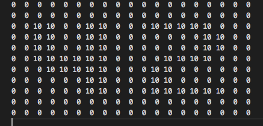
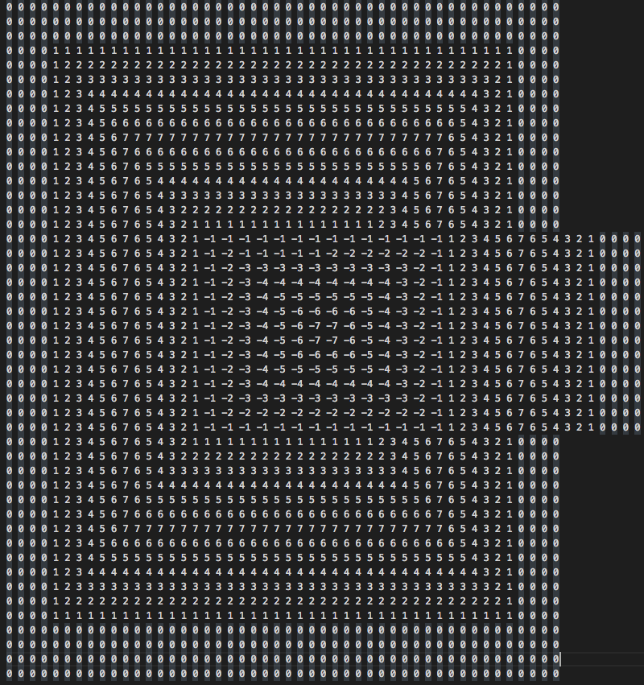
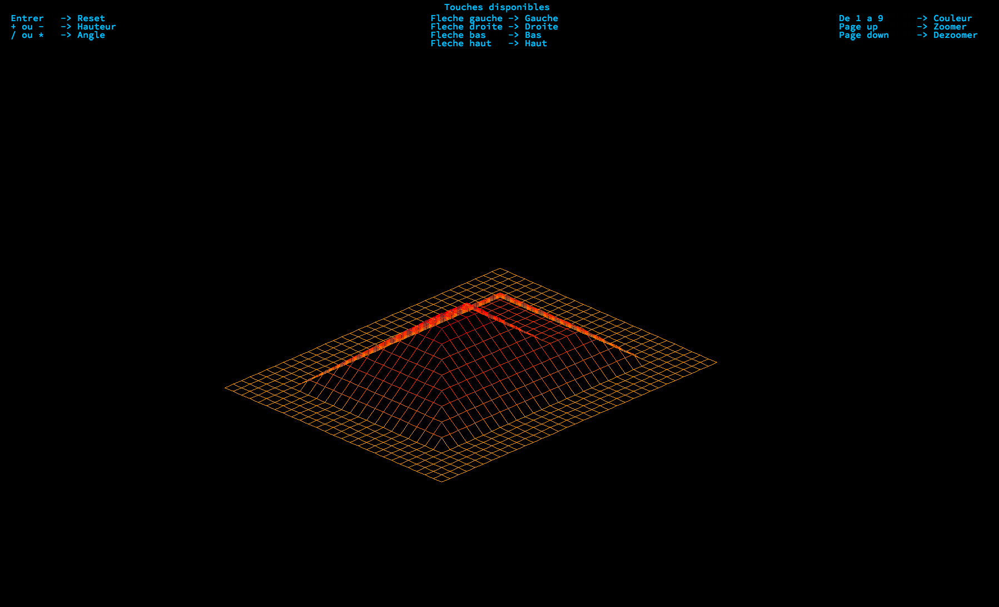
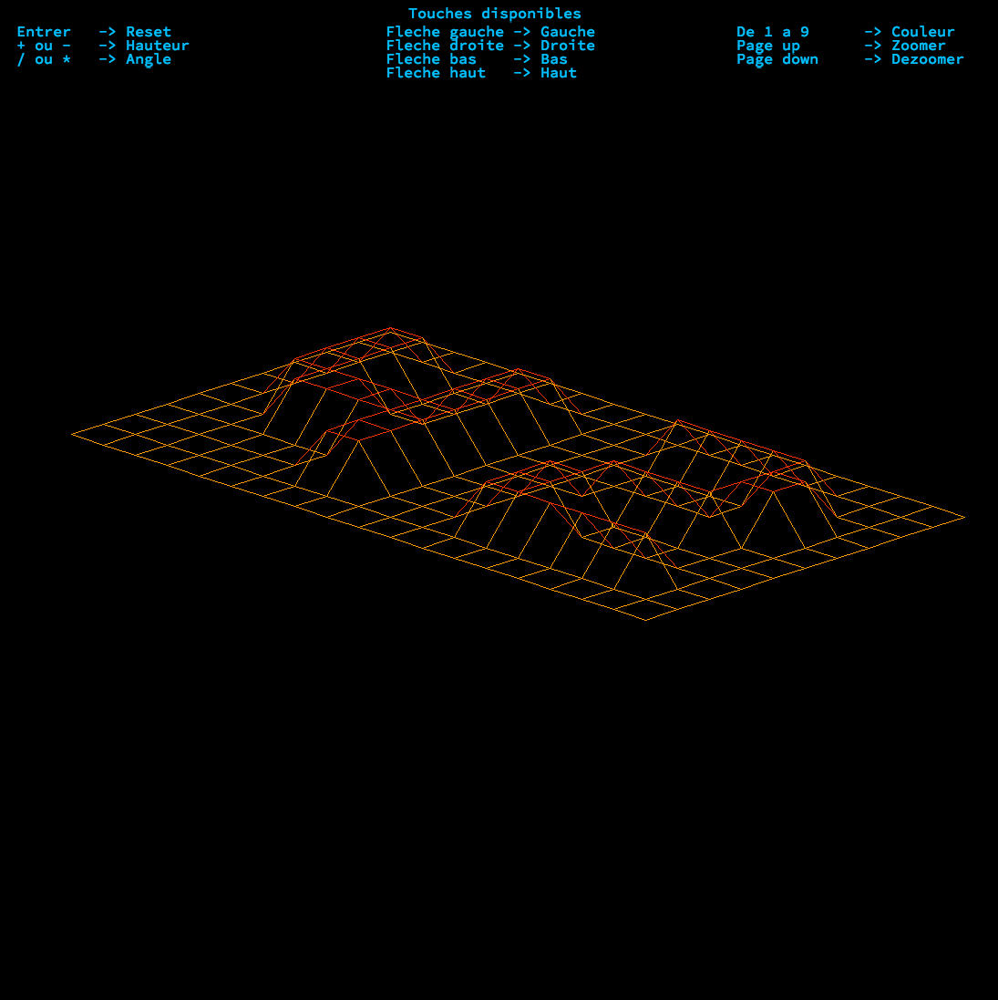
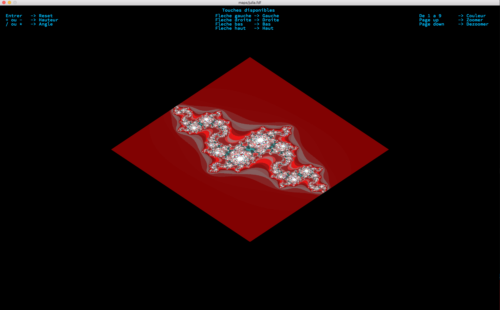

<h1 align="center">Project Fdf</h1>

    Le but de ce projet est de tracer des lignes entre les diffents point de la map qu'on lui rentre en parametre en prenant en compte la hauteur et la couleur.

<h2 align="center">Exemple de Map</h2>

    
     
    

<h2 align="center">Exemple rendu du programme</h2>

    
     
    
     
    

